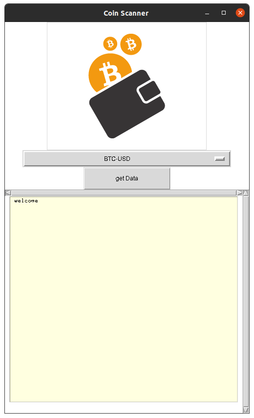

# About
- 👋 Hi, I’m @LaghroubiMohamed
- 👀 I’m interested in Data Science and mobile app development with flutter and dart 🐦
- 🌱 I’m currently learning Python and R 
- 📫 How to reach me : laghroubi.mohamed@gmail.com

# python-scraping
  this is a simple script to scrap crypto-currencies data from finance.yahoo.com
  
## Plant App Final UI

 

## Getting Started
###  install a chrome driver depend on your current version of Google chrome and change the path in interface.py
### you can start the programe interface from the file interface.py
 
